# opencola-alpha

Welcome to the OpenCola alpha. We look forward to hearing your feedback and getting help ironing out the wrinkles. While a lot of the foundation is complete, we will continually be working on adding new features.

Feel free to add issues your come across to [issues](https://github.com/johnmidgley/opencola-alpha/issues) for this repo or email dev@opencola.io.

You're also welcome to share this alpha with friends, but we are limited on the amount of support we can provide, so we will prioritize those on the alpha list.

# Installation

## Prerequisites

<details><summary>Install Docker</summary>
 <br/>
 
Download and install Docker from https://www.docker.com/

<details><summary>Why Docker?</summary>
<br>
<p>
OpenCola currently runs inside a docker container, which provides a few advantages over a direct install:

1. It isolates the application so it can only access it's data folder and communicate on controlled ports (5795 for http and 5796 for https)
2. It isolates system dependencies (i.e. the Java 11 runtime)
3. It allows for a network of isolated services to be deployed (i.e. Tor proxy and router)
4. It makes it easy for OpenCola to be hosted on another computer, if desired.
</p>
</details>

In order to make sure that OpenCola runs at startup / login, set docker to start when you log in:


</details>

## Install OpenCola

1. Download the [release](https://github.com/johnmidgley/opencola-alpha/releases/tag/v0.1.1-alpha)
2. Unarchive it wherever you like (we'll call this location $OPENCOLA)

# Starting OpenCola

Open a terminal and navigate to $OPENCOLA. Then follow the instructions for you OS:

<details><summary>MacOS</summary>

```
cd mac
./start
```

You should see output similar to:

```
Creating storage
No SSL certificate found
[+] Running 2/2
 ⠿ Network opencola_default   Created 0.0s
 ⠿ Container opencola-server  Started 0.3ss
Docker container started
Waiting for certificate creation
New certs have been created. Install (y/n)?
```

If this is the first time you're starting OpenCola, a TLS certificate will have been generated so that you can use OpenCola over https. Enter 'y' to install the certificate. This requires sudo access, so you will have to enter your system password on the command line, and once again in a UI dialog for the key tool.


```
y
~/.opencola/storage/cert ~/dev/opencola/install/unix
Password:
~/dev/opencola/install/unix
Server started - visit http://localhost:5795
                   or https://localhost:5796 (Secure - recommended)
```

</details>

<details><summary>Windows</summary>

1. Click the Start icon in the taskbar or hit the windows key.
2. Type 'command prompt'
3. Click "Run as Administrator"

```
cd $OPENCOLA\windows
start.bat
```

You'll see a number of log lines and then a browser window will open to set a password.

To install certificates so that you can use https:

```
cd %USERPROFILE%\AppData\Roaming\opencola\storage\cert
install-cert.bat
```

</details>
<details><summary>Linux</summary>

```
cd linux
./start
```

You should see output similar to:

```
Creating storage
No SSL certificate found
Creating network "opencola_default" with the default driver
Building oc
Creating opencola-server ... done
Docker container started
Waiting for certificate creation
New certs have been created. Install (y/n)?
```

If this is the first time you're starting OpenCola, a TLS certificate will have been generated so that you can use OpenCola over https. Enter 'y' to install the certificate. On linux, this must be done manually, so follow the instructions that are output:

```
A certificate has been placed at ~/opencola-ssl.pem
You must manually install it into your browser. For Chome based browsers:
 1. Open chrome://settings/certificates in your browser
      (or brave://settings/certificates for Brave)
 2. Select the 'Authorities' tab
 3. Click the 'Import' button'
 4. Select 'opencola-ssl.pem' from your home directory
 5. Check 'Trust this certificate for identifying websites'
 6. Click 'OK'

~/dev/opencola/install/unix
Server started - visit http://localhost:5795
                   or https://localhost:5796 (Secure - recommended)
```                   
</details>
<p>

Once you've followed the instructions for you OS, navigate to https://localhost:5796. (You can use plain http link too, but it is not secure)

## Setting a Password
The first time you start OpenCola, you'll be prompted to set a password:
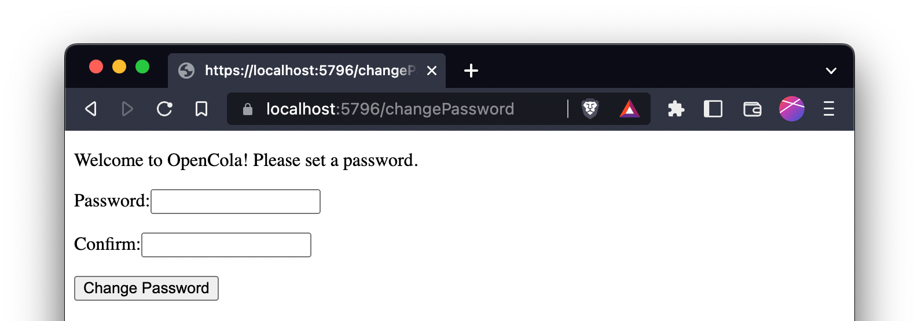

Enter a password and confirm it.

## Logging in

After setting your password, or whenever you start OpenCola thereafter, you will be prompted to enter a username and your password to continue. The user name is used for web authentication. It can be anything you like, but if you want to change it, you must set it in the config file (storage/opencola-server.yaml). Once your password is set, you'll be prompted to login to the app. Using the default username 'oc' the page looks like:

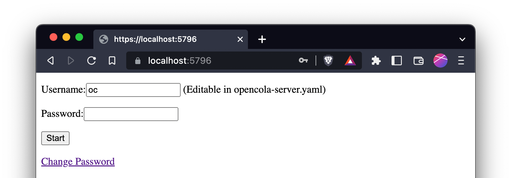

Lastly, you will need to authenticate your browser. (This step is currently necessary because we're using digest-auth. We'll likely switch to a cookie based auth which would remove this step):
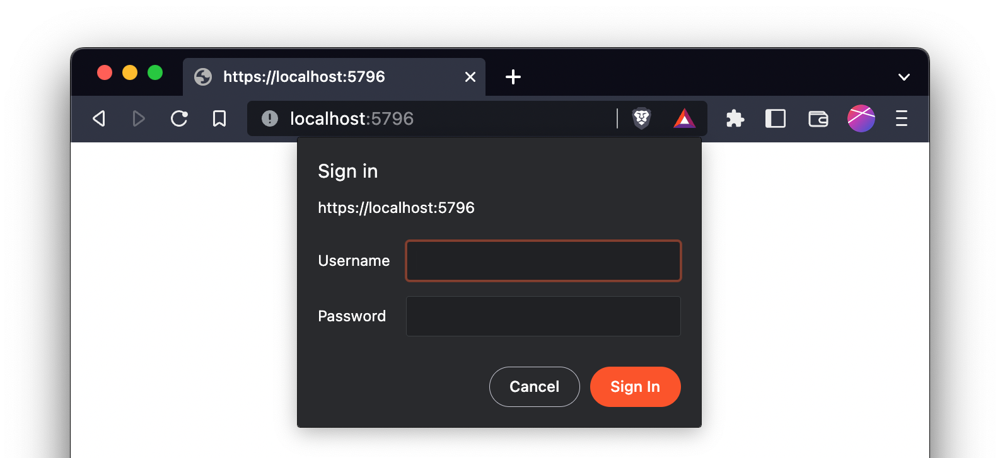

Now OpenCola is ready to use, and you will see your (empty if this is the first time running) feed:
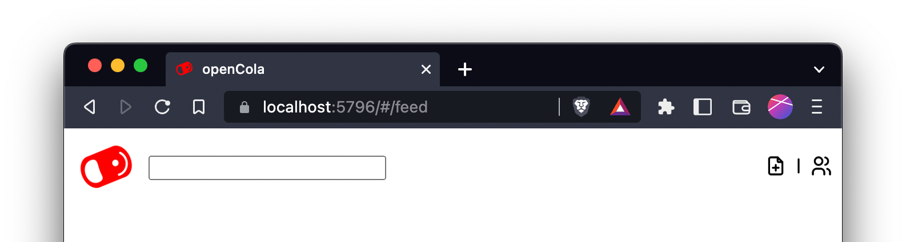

# Setting up Your User

You can set a display name and image for yourself in peer settings by clicking the  icon:
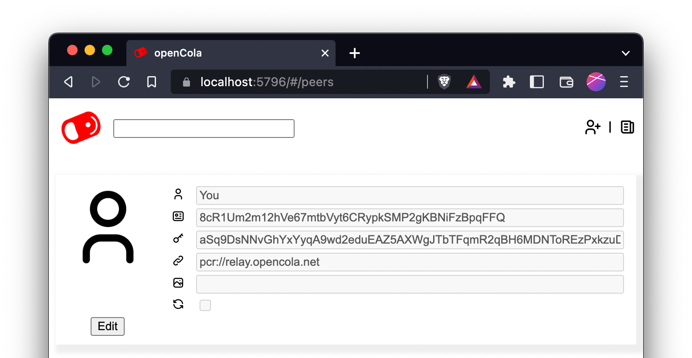

Fields:

| Field | Description |
| --- | --- |
|  | Name visible to peers when you connect (more later) |
|  | Your gobally unique OpenCola user id - not changeable |
|  | A cryptogrpahic public key used to encrypt and sign data - not changeable yet |
|  | The address at which peers can request data from you. Default is to use the OpencCola relay server (see [Adding Peers](#adding-peers) for more details) |
|  | Url of image for your picture. This has to be a web link right now. |
|  | Whether or not the user is actively being sychronized with (more later) |

# The Browser Extenion

## Installing the Extension

<details><summary>Instructions</summary>
  
OpenCola comes with a browser extension. It currenlty only works with Chrome based browsers (e.g. Chrome, Chromium, Brave, Edge). We will provide other extnsions in the future. To install the extension, go to your browsers extensions page. In Brave, navigate to brave://extensions, which looks like:


In the future, we will provide the extension in the Web Store, but for now you must install it manually. To do so, click the "Developer mode" slider:


Then click "Load Unpacked" and select the folder $OPENCOLA/chrome.


Lastly, pin the extension to your toolbar (so it's always visible) by clicking the extension icon (the puzzle piece) and click the pin beside OpenCola:

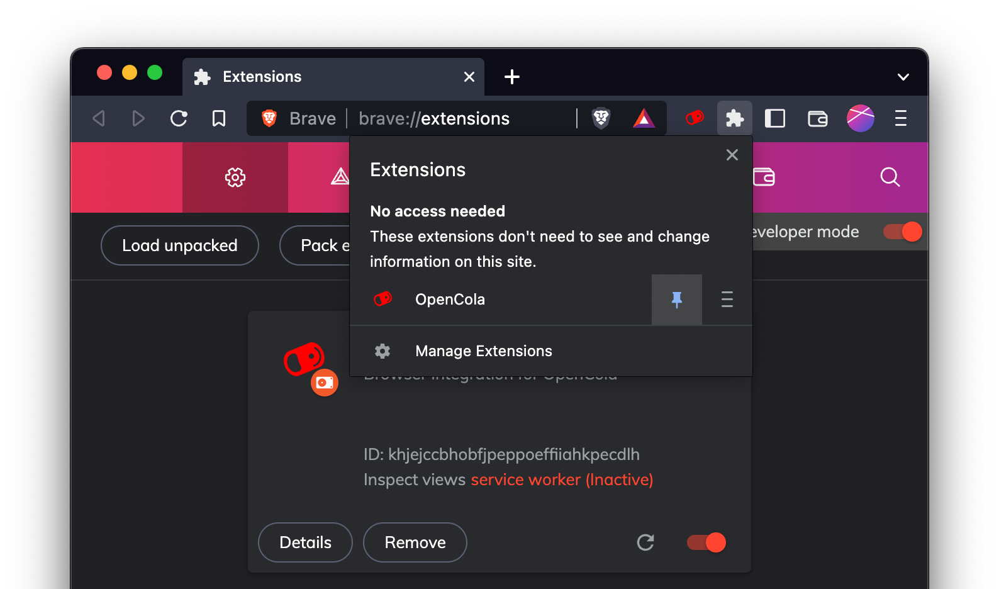

</details>

## Using the Extension

To use the extension, simply click the OpenCola icon in the toolbar:

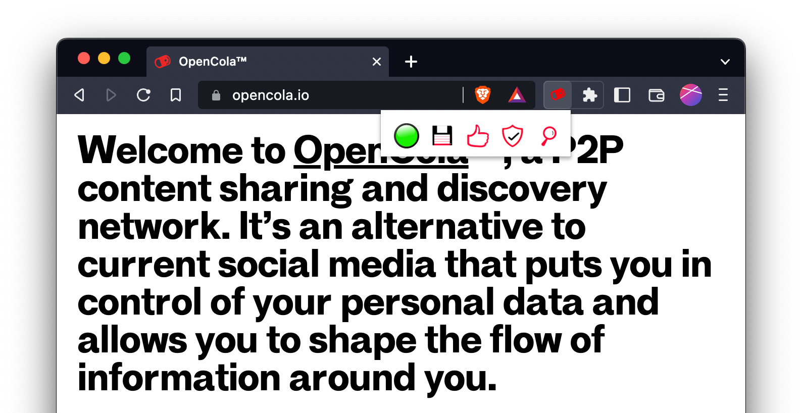

The various icons mean:

| Icon | Description |
| --- | --- |
|  | Staus of the extension. Green means all good, yellow means working, and red means error. Check the Javascript console for more info on error. |
| 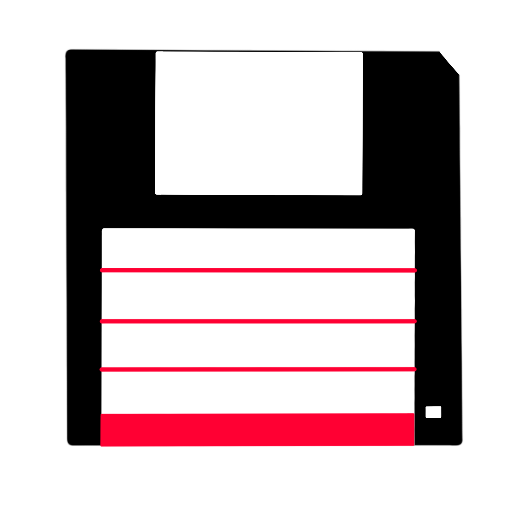 | Save the current page (Add to feed, store archive, and index for search) |
|  | Like the current page (saves page implicitly |
|  | Trust the current page (saves page implicitly) |
|  | Go to search / feed page |

# Understanding Your Feed

You can add items to your feed by using the toolbar or creating organic (not tied to a url) posts using the  button at the top right of the feed page. Once you've added to your feed, it will look something like (annotations in red):


You can see activty for the post as well as take action by using the action bar at the bottom. If you click the action icon, the corresponding action will be taken. Underlined (with a grey bar) action icons indicate actions that you have taken yourself. The number beside the icon indicates how many actions of that type have occured. You can see the individual actions by clicking expand () icon.

| Action | Description |
| --- | --- |
|  | Save the post. This essentially copies the post and allows any of your peers to see it as if it came from you. |
|  | Like the post (save post implicitly) |
|  | Add tags to the post |
|  | Comment on the post (save post implicitly) |
| 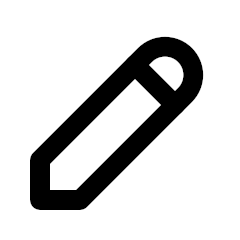 | Edit the post. Gives you an option to delete the post (if it was yours) |

You can search your feed by entering a query in the search box. Currently, search is exact match only, but will be improved in the future.

# Adding Peers

To add a peer, click the  icon at the top right of your feed and then click the  icon.
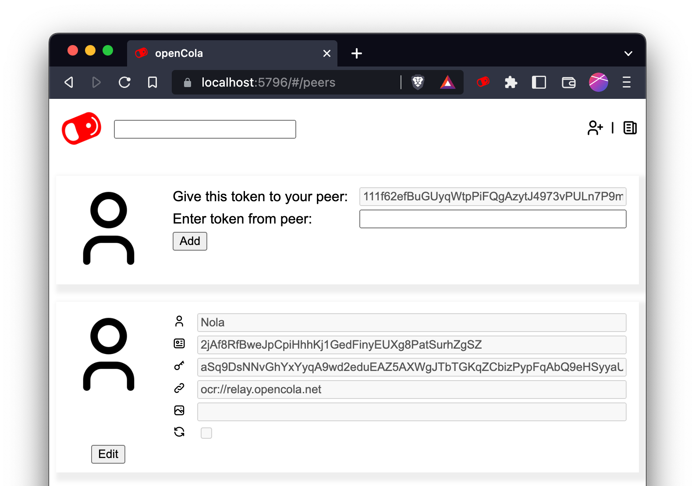

Copy the token beside "Give this token to your peer:" and give it to a peer (via Signal, email, sms, etc). Enter the token you receive from the peer in the other box. Click "Add" - edit the name a image url if desired, and then click "Save".

By default you will be using the OpenCola Relay server (ocr://relay.opencola.net) to communicate with peers. Communication is end to end encrypted, but does travel through a central server. There are more advanced options (Tor, ZeroTier VPN) that will be documented, but are not for the faint of heart, so we default to the relay server as a "batteries included" solution.

# Removing Peers

You can "disconnect" from a peer without losing any of the posts your have accumulated by simply unchecking the box beside the  icon for the peer. If you want to completely disconnect, edit the peer and click "Delete".

# OpenCola on Mobile

We currently do not have native mobile apps. To access OpenCola on a mobile device, simply navigate to one of the (non-local) urls listed at startup (if you want to use https, see [Installing Certificate](#installing-certificates) below). This works when on the same LAN as your server. To access anywhere, see the next section.

# Accessing OpenCola from Anywhere

We currently have not built any services that allow you to access you OpenCola server from anywhere (i.e. outside the LAN it's running on). For the time being, we rely on ZeroTier, an open source project that allows you to create private VPNs. We recognize that this is not for the faint of heart, and will provide a more seamless solution in the future.

<details><summary>Setting up ZeroTier</summary>
<br/>
In order to use ZeroTier, you must create an account, set up a network, and run the client on any devices that are running or would like to access OpenCola.

To create an account, simply go to [ZeroTier](https://www.zerotier.com/) and sign up. Once signed, up, navigate to your [networks](https://my.zerotier.com/network), which should look something like:
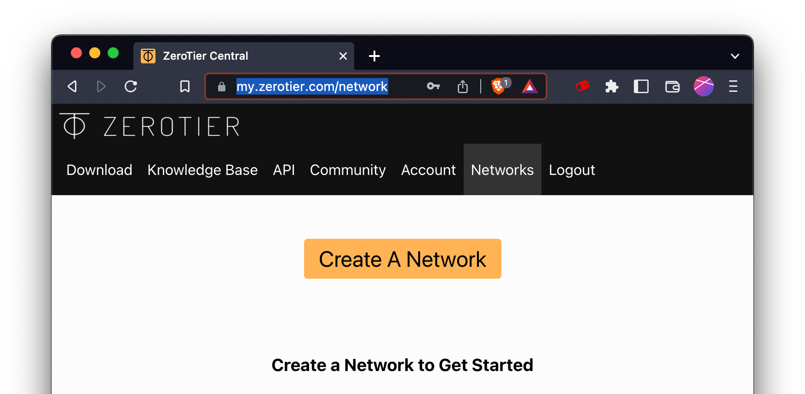

Click "Create A Network". A network with a random name will be created, something like:
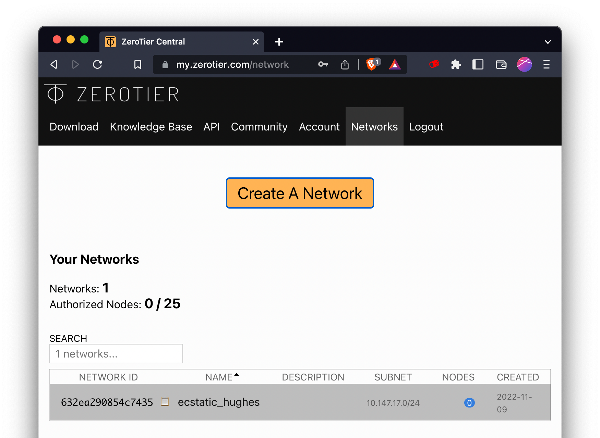

Click on the network to edit it. While there are many settings on the page, you can just use the defaults. It is helpful to give the network a meaningful name (e.g. opencola):
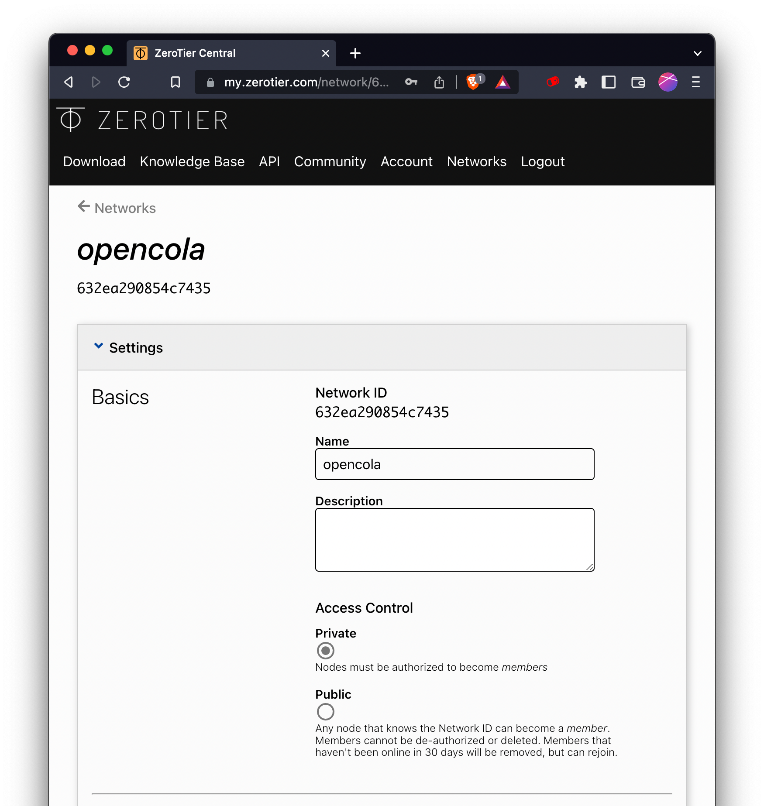

Take note of the network id (in this case, 632ea290854c7435). For each device you would like to add to the network, [download](https://www.zerotier.com/download/) and install the client. Once installed, you need to join the network. To do this, open ZeroTier on your device and add your network:
- On Mac, click the ZeroTier icon in your menu bar, "Open Control Panel", and enter the network id in the box beside "Join Network" at the bottom.
- On iOS, open the app, click + at the top right, Accept the terms and then enter the NetworkId

Other OSs we haven't tried yet, but the process should be similar.

Once your devices have been added, return to the network and scroll to the "Members" section and check the "Auth?" box beside the addresses you've added.

 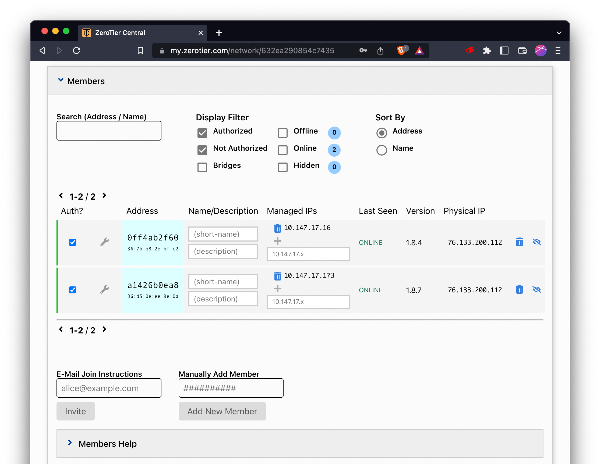

Each device will now have an additional ip address assigned, which will be in the range set for the network (scroll to IPv4 Auto-Assign in the network config):

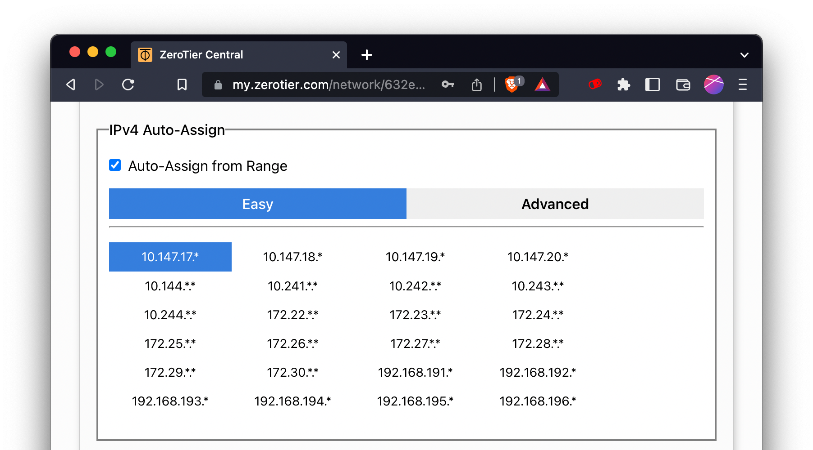

Go to go the machine running opencola (that you should have installed ZeroTier on) and restart the server by running the following commands in your OpenCola os directory:
```
./stop
./start
```
You'll notice new access urls that with a new ip address. You can use these addresses to access OpenCola from anywhere. The VPN is private and secure (traffic is encrypted), so you can use http if you like, or https to be extra safe. If you decide to use https, make sure to regenerate new certificates (that will include the ZeroTier ip address), as described next.

</details>

# Installing Certificates

The first time you start OpenCola, it will generate certificates so that you can access the application over https without security warnings. These certificates will be placed in ~/.opencola/storage/cert. If you ever need to generate new ones, simply delete the generated files (opencola-ssl*) and restart your server. This will create new certificates and prompt you to install on the local machine.

For any other device, you will need to copy and add the certificates manually (in the future, with mobile apps, this won't be required). If you're not concerned about security (e.g. if you're on your local network or using ZeroTier), you can just use the http access links and skip the install steps below.


</details>
<details><summary>Computer</summary>
<br/>
 
To access OpenCola over https from another computer, simply copy the `install-cert` (or `install-cert.ps1` on Windows) and `opencola-ssl.der` to the same directory on the computer and runs:
```
./install-cert
```
</details>

</details>
<details><summary>iOS</summary>
<br/>
 
1. From ~/.opencola/storage/cert, copy `opencola-ssl.pem` to your device. The simplest way to do this is just to mail it to your device as an attachment and then save it to your local files.
1. Open "Files" (Swipe down on your main menu, type files into the search and then open the app)
1. In Locations, select "On My iPhone", then "Downloads"
1. Tap `opencola-ssl.pem`. A dialog will tell you that the profile has been downloaded
1. Open "Settings". Under your name, tap the "Profile Downloaded" section
1. Click "install" at the top right of the resulting "Install Profile" page
1. Enter your passcode (if needed)
1. Click "Install" at the top right (and in the next dialog)
1. Go back to the "Settings" homepage, then to "General" -> "About"
1. Scroll to the bottom and tap "Certificate and Trust Settings"
1. Tap the slider next to "OpenCola" and click "Continue"


</details>

</details>
<details><summary>Android</summary>
<br/>
 
1. From ~/.opencola/storage/cert, copy `opencola-ssl.der` to `opencola-ssl.crt` and then trandfer it to your device. The simplest way to do this is just to mail it to your device as an attachment and then save it to your local files.
1. On your Android admin dashboard go to Settings > Security
1. Under Credential Storage click on Install from Phone Storage/Install from SD Card
Note: if you don’t have this option, navigate to Advanced Settings > Security or Advanced Settings > Privacy and click on Install from Phone Storage/Install from SD Card.
1. The File Storage Manager will appear. Locate your SSL Certificate from your device
1. In the Certificate Name field, enter a friendly name for your certificate
1. Under Credential Use select VPN and Apps or Wi-Fi based on your security requirements.

</details>
