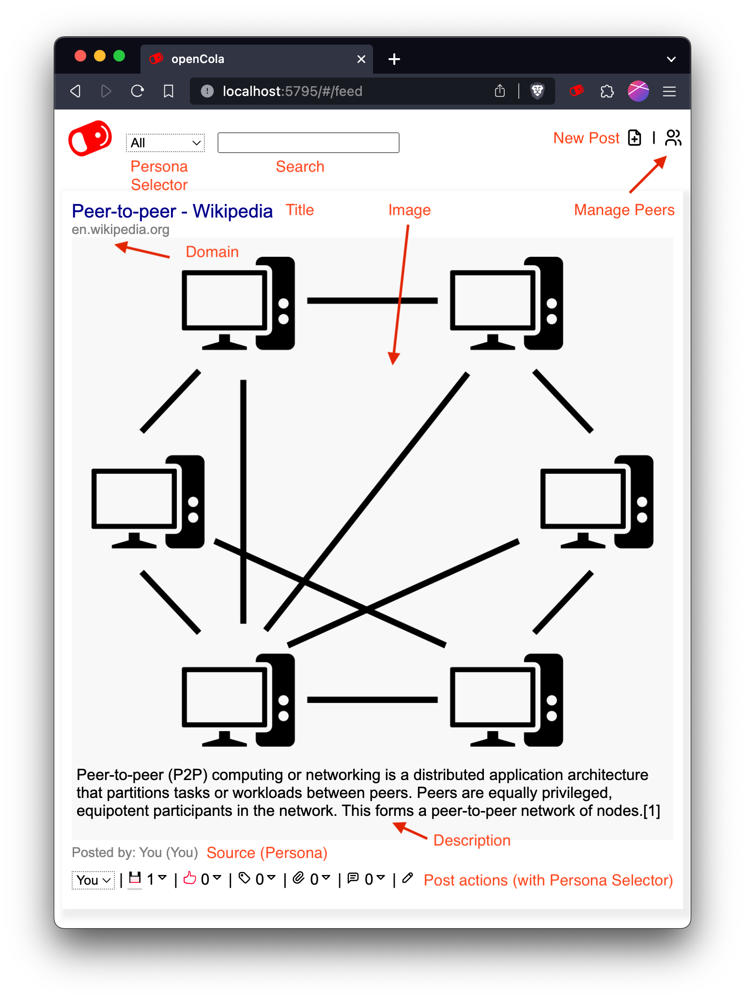

# opencola-alpha

Welcome to the [OpenCola](https://opencola.io) alpha. We look forward to hearing your feedback and getting help ironing out the wrinkles. While a lot of the foundation is complete, we will continually be working on adding new features and making it easier to install / use. Some key things that we will be working on:

1. **Sharing arbitrary files**: Currently, the things you share must be on the web (pages, PDFs, images). We will add functionality so that you can share content directly from your computer.
2. **Personas**: All activity is associated to single idenity. We will add functionality so that you can have different personas (family, friends, work, etc.) so that you can segment you activity in intuitive ways.
3. **Mobile Apps**: You can use OpenCola on mobile as a web app, but we intend to have native apps to make things easier to use.
4. **Data Importers**: Since most people have a lot of content on existing sites, we will implement importers to make it easy to import activity into OpenCola.

Feel free to add issues you come across to [issues](https://github.com/johnmidgley/opencola-alpha/issues) for this repo (preferred) or email dev@opencola.io. If you have questions, please use the [discussions](https://github.com/johnmidgley/opencola-alpha/discussions) area, so that others can benefit from the answers. 

You're also welcome to share this alpha with friends, but we are limited on the amount of support we can provide, so we will prioritize those on the alpha list.

# Installation
  
## Server

- [MacOS](https://github.com/johnmidgley/opencola-alpha/releases/download/1.1.5/OpenCola-1.1.5.dmg)
- [Windows](https://github.com/johnmidgley/opencola-alpha/releases/download/1.1.5/OpenCola-1.1.5.msi)
- [Linux](https://github.com/johnmidgley/opencola-alpha/releases/download/1.1.5/OpenCola-1.1.5.tgz)
- [Docker Based](https://github.com/johnmidgley/opencola-alpha/releases/download/1.1.5/OpenCola-1.1.5.zip)

## Browser Extension

In addition to installing the server, you will want to install the browser extension:
- [Chrome Extension](docs/chrome-extension.md)

## Device Certificates

The first time you start OpenCola, it will generate certificates so that you can access the application over https without security warnings. These certificates will be placed in (~/.opencola/storage/cert. If you ever need to generate new ones, delete the generated files (opencola-ssl*) and restart your server. This will create new certificates and prompt you to install on the local machine.

For any other device, you will need to copy and add the certificates manually (in the future, with mobile apps, this won't be required). If you're not concerned about security (e.g. if you're on your local network or using ZeroTier), you can just use the http access links and skip the install steps below.


</details>
<details><summary>Computer</summary>
<br/>

To access OpenCola over https from another computer, copy the `install-cert` (or `install-cert.ps1` on Windows) and `opencola-ssl.der` to the same directory on the computer and run:
```
./install-cert
```
</details>

</details>
<details><summary>iOS</summary>
<br/>

1. From ~/.opencola/storage/cert, copy `opencola-ssl.pem` to your device. The simplest way to do this is just to mail it to your device as an attachment and then save it to your local files.
1. Open "Files" (Swipe down on your main menu, type files into the search and then open the app)
1. In Locations, select "On My iPhone", then "Downloads"
1. Tap `opencola-ssl.pem`. A dialog will tell you that the profile has been downloaded
1. Open "Settings". Under your name, tap the "Profile Downloaded" section
1. Click "install" at the top right of the resulting "Install Profile" page
1. Enter your passcode (if needed)
1. Click "Install" at the top right (and in the next dialog)
1. Go back to the "Settings" homepage, then to "General" -> "About"
1. Scroll to the bottom and tap "Certificate and Trust Settings"
1. Tap the slider next to "OpenCola" and click "Continue"


</details>

</details>
<details><summary>Android</summary>
<br/>

1. From ~/.opencola/storage/cert, copy `opencola-ssl.der` to `opencola-ssl.crt` and then trandfer it to your device. The simplest way to do this is just to mail it to your device as an attachment and then save it to your local files.
1. On your Android admin dashboard go to Settings > Security
1. Under Credential Storage click on Install from Phone Storage/Install from SD Card
Note: if you don’t have this option, navigate to Advanced Settings > Security or Advanced Settings > Privacy and click on Install from Phone Storage/Install from SD Card.
1. The File Storage Manager will appear. Locate your SSL Certificate from your device
1. In the Certificate Name field, enter a friendly name for your certificate
1. Under Credential Use select VPN and Apps or Wi-Fi based on your security requirements.

</details>


# Understanding Your Feed

You can add items to your feed by using the toolbar or creating organic (not tied to a url) posts using the  button at the top right of the feed page.

> TIP: When you create an item using the  button, if the only thing you enter is a link in the description field, it will automatically extract the title, image and description from the page, similar to how the toobar saves pages. This is especially useful on mobile, where there isn't a toolbar.

 Once you've added to your feed, it will look something like (annotations in red):



You can see activty for the post as well as take action by using the action bar at the bottom. If you click the action icon, the corresponding action will be taken. Underlined (with a grey bar) action icons indicate actions that you have taken yourself. The number beside the icon indicates how many actions of that type have occured. You can see the individual actions by clicking expand () icon.

| Action | Description |
| --- | --- |
|  | Save the post. This essentially copies the post and allows any of your peers to see it as if it came from you. |
|  | Like the post (save post implicitly)  |
|  | Add tags to the post |
|  | Comment on the post (save post implicitly) |
|  | Edit the post. Gives you an option to delete the post (if it was yours) |

You can search your feed by entering a query in the search box. Currently, search is exact match only, but will be improved in the future.

# Using the Extension

To use the extension, click the OpenCola icon in the toolbar:


The various icons mean:

| Icon | Description |
| --- | --- |
|  | Staus of the extension. Green means all good, yellow means working, and red means error. Check the Javascript console for more info on error. |
|  | Save the current page (Add to feed, store archive, and index for search) |
|  | Like the current page (saves page implicitly |
|  | Trust the current page (saves page implicitly) |
|  | Go to search / feed page |


# Managing Peers

To add a peer, click the  icon at the top right of your feed and then click the  icon.


Copy the token beside "Give this token to your peer:" and give it to a peer (via Signal, email, sms, etc). Enter the token you receive from the peer in the other box. Click "Add" - edit the name and image url if desired, and then click "Save". You don't need to keep your browser open while waiting for a token from your peer - you can whenever you get the token.

By default you will be using the OpenCola Relay server (ocr://relay.opencola.net) to communicate with peers. Communication is end to end encrypted, but does travel through a central server. There are more advanced options (Tor, ZeroTier VPN) that will be documented, but are not for the faint of heart, so we default to the relay server as a "batteries included" solution.

You can "disconnect" from a peer without losing any of the posts your have accumulated by unchecking the box beside the  icon for the peer. If you want to completely disconnect, edit the peer and click "Delete".

# OpenCola on Mobile

We currently do not have native mobile apps. To access OpenCola on a mobile device, simply navigate to one of the (non-local) urls listed at startup (if you want to use https, see [Installing Certificates](#installing-certificates) below). This works when on the same LAN as your server. To access anywhere, see the next section.

# Accessing OpenCola from Anywhere

We currently have not built any services that allow you to access you OpenCola server from anywhere (i.e. outside the LAN it's running on). For the time being, we rely on ZeroTier, an open source project that allows you to create private VPNs. We recognize that this is not for the faint of heart, and will provide a more seamless solution in the future.

- [ZeroTier Setup](docs/zerotier-setup.md)
