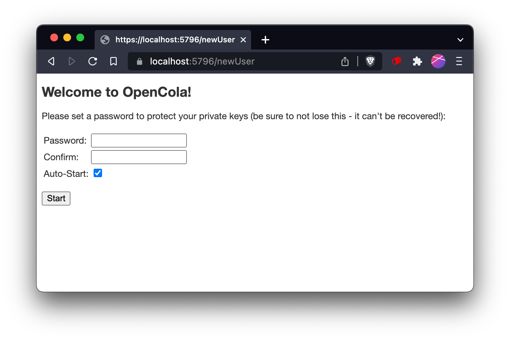
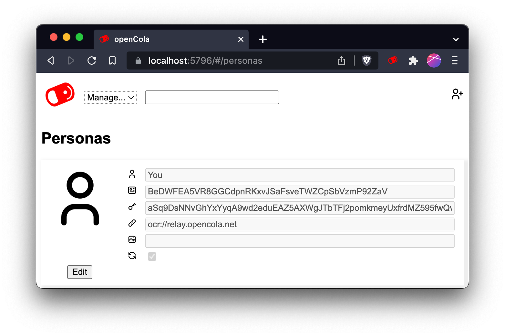
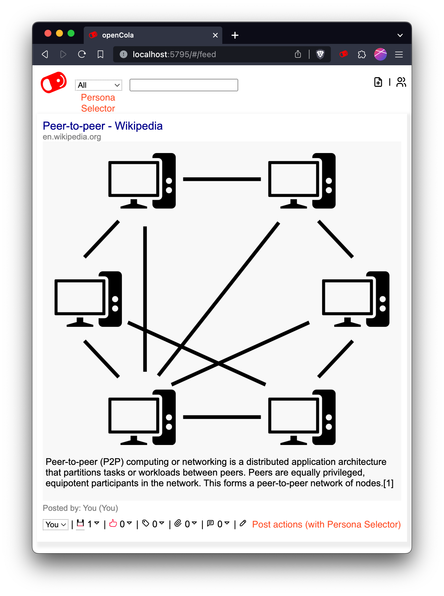
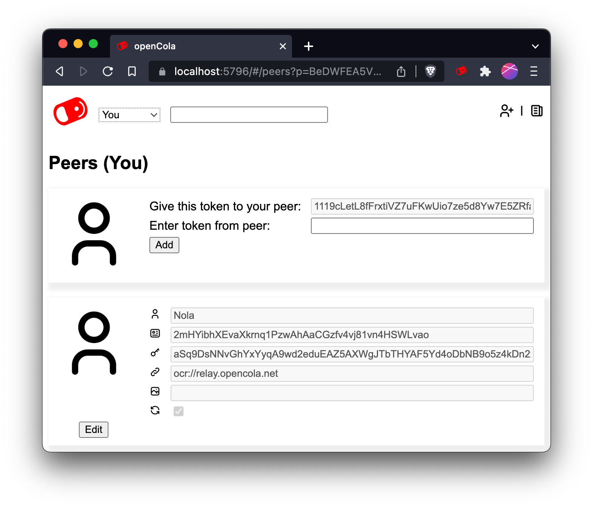

# opencola-alpha 1.3.2
_updated 9/15/2023_


Welcome to the [OpenCola](https://opencola.io) alpha. We look forward to hearing your feedback and getting help ironing out the wrinkles. While a lot of the foundation is complete, we will continually be working on adding new features and making it easier to install / use. Some key things that we will be working on:

1. **Mobile Apps**: We are currently working on a mobile app in Flutter that will support both iOS and Android devices. 
2. **UI Design**: The current UI desing is intentionally mininmalistic, meant to show the overall functionality in a simple way. We will work with an actual designer to develop a proper "feel" to the application.   
3. **Data Importers**: Since most people have a lot of content on existing sites, we will implement importers to make it easy to import activity into OpenCola.

Feel free to add issues you come across to [issues](https://github.com/johnmidgley/opencola-alpha/issues) for this repo (preferred) or email dev@opencola.io. If you have questions, please use the [discussions](https://github.com/johnmidgley/opencola-alpha/discussions) area, so that others can benefit from the answers. 

You're also welcome to share this alpha with friends, but we are limited on the amount of support we can provide, so we will prioritize those on the alpha list.


# New in version 1.3.2

Fixed issues with display of attachments

# New in version 1.3.1

This release brings some important features and imrpovements as well as a number of minor bug fixes.


## File attachments

You can now added arbitrary file attachments to posts, allowing you to share pdf documents, images and more.

## Cleaned up UI

* Image treatment is now more promininet, giving your feed a more traditional feed look. 
* Creating / editing posts has been simplified
* Comments are now done in a markdown wysiwyg editor.  

## Standardized Serialization 

The original storage serialization formats were custom for maximum size efficiency. These formats have now been moved to protobuf, improving future interoperability and extendability.

> NOTE if you're upgrading: Since the transaction data format has changed, your transaction chain needs to be re-generated and re-signed. When you start OpenCola, your data will be automatically migrated. You will temporarily lose access to your peer data, because it is incompatible with the new format. Once your peers upgrade, their data will automatically re-synchronize. 

## Re-write of Relay Server Protocol

The new relay server protocol use protobuf messages, includes a number of efficiency improvements, and now supports store and forward functionality, so that you can receive peer updates even when they are not online

## New in Older Versions
[New in version 1.2.0](1.2.0-release-notes.md)

# Installation
OpenCola runs a small server on your computer. You use OpenCola through a your web browser just like a web app or service except you're connecting to the OpenCola server software on your machine.

## Server

- [MacOS](docs/macOS/install.md)
- [Windows](docs/windows/install.md)
- [Linux](docs/linux/install.md)
- [Docker Based](docs/docker/install.md)


## Browser Extension

In addition to installing the server, you will want to install the browser extension:
- [Chrome Extension](docs/chrome-extension.md)


# Setting Up
[](#setting-up)

After starting OpenCola and installing certificates, you will see:

Enter a password and confirm it. 

<p> <strong>*** Save this password somewhere safe. If you lose it, you can reocover your data, but your identity will be
lost and you will have to reconnect with any peers ***</strong> </p>

>Leave <strong>Auto-Start</strong> checked to have OpenCola start when you log in, so that you can exchange posts with peers in the background. 
>
> On MacOS, setting autostart will trigger a security dialog, asking for permission to control <strong>System Events</strong>. Click <strong>OK</strong> to allow OpenCola to auto-start.
>
> 
>
> On Linux, autostart assumes a gnome based environment, and will add a file to ```~/.config/autostart```

Click <strong>Start</strong>, after which you will see:


The server will take a few seconds to create and initialize your storage, after which you will end up on your feed:


You can set a display name and image for yourself by clicking the persona selector and selecting manage. This view shows you all the personas you have created. To edit fields, click <strong>Edit</strong>. To add a new persona, click the  icon.



The fields for each entry are:

| Field | Description |
| --- | --- |
|  | Name visible to peers when you connect (more later) |
|  | Your gobally unique OpenCola user id - not changeable |
|  | A cryptogrpahic public key used to encrypt and sign data - not changeable yet |
|  | The address at which peers can request data from you. Default is to use the OpencCola relay server (see [Managing Peers](#managing-peers) for more details) |
|  | Url of image for your picture. This has to be a web link right now. |
|  | Whether or not the user is actively being sychronized (more later) |


# Understanding Your Feed

You can add items to your feed by using the toolbar or creating organic (not tied to a url) posts using the  button at the top right of the feed page.

> TIP: When you create an item using the  button, if the only thing you enter is a link in the description field, it will automatically extract the title, image and description from the page, similar to how the toobar saves pages. This is especially useful on mobile, where there isn't a toolbar.

 Once you've added to your feed, it will look something like (annotations in red):


You can see activity for the post as well as take action by using the action bar at the bottom. If you click the action icon, the corresponding action will be taken. Underlined (with a grey bar) action icons indicate actions that you have taken yourself. The number beside the icon indicates how many actions of that type have occured. You can see the individual actions by clicking expand () icon.

| Action | Description |
| --- | --- |
|  | Save the post. This essentially copies the post and allows any of your peers to see it as if it came from you. |
|  | Like the post (save post implicitly)  |
|  | Add tags to the post |
|  | Attach files to the post. These files will be propagated to peers. If images are attached, they are rendered as part of the post body. Other file types are rendered as links. |
|  | Comment on the post (save post implicitly) |
|  | Edit the post. Gives you an option to delete the post (if it was yours) |

You can search your feed by entering a query in the search box. Currently, search is exact match only, but will be improved in the future.

# Using the Extension

To use the extension, click the OpenCola icon in the toolbar:


The various icons mean:

| Icon | Description |
| --- | --- |
|  | Staus of the extension. Green means all good, yellow means working, and red means error. Check the Javascript console for more info on error. |
|  | Save the current page (Add to feed, store archive, and index for search) |
|  | Like the current page (saves page implicitly) |
|  | Trust the current page (saves page implicitly) |
|  | Go to search / feed page |

Use the Persona selector to choose where you want to save your item (see next section on Personas)

# Personas

Personas give you ways to organize your conversations with Peers. Each persona can have a unique set of Peers to connect with. It's like having separate identities you can share with people for different purposes.

The main Persona selector can be found at the top of most pages of OpenCola. Use it to quickly switch between your feeds and peers. This is how you tell which Persona is currently active. 

On your feed when "All" personas is selected, there's also a Persona selector in the action bar below each post. This one lets you quickly take action as a Persona when you save, comment, tag, etc. It's most useful for transferring posts between Personas. If you wanted to save a post from your Work persona to your Crochet Clan persona you would just find the post, choose "Crochet Clan" in the selector and click the "Save" icon.



To add or edit a persona use the the Persona selector and choose <strong>Manage</strong>. This will take you to the Persona page. 

You can use the "+" icon at the top right of the page to add a persona or choose <strong>Edit</strong> below any of your personas to change details.


Each Persona has it's own set of <strong>Peers</strong>. To start adding people to your Personas network just use the Persona selector at the top of the page and navigate to your <strong>Peers</strong> with 


If you would like to have a private Persona, for taking notes, etc., simply uncheck the sync option  for the persona. This will ensure that no data is sent / received to any peer for this persona. 

# Managing Peers

To add a peer, click the  icon at the top right of your feed and then click the  icon.


Copy the token beside "Give this token to your peer:" and give it to a peer (via Signal, email, sms, etc). Enter the token you receive from the peer in the other box. Click "Add" - edit the name and image url if desired, and then click "Save". You don't need to keep your browser open while waiting for a token from your peer - you can whenever you get the token.

By default you will be using the OpenCola Relay server (ocr://relay.opencola.net) to communicate with peers. Communication is end to end encrypted, but does travel through a central server. There are more advanced options (Tor, ZeroTier VPN) that will be documented, but are not for the faint of heart, so we default to the relay server as a "batteries included" solution.

You can "disconnect" from a peer without losing any of the posts your have accumulated by unchecking the box beside the  icon for the peer. If you want to completely disconnect, edit the peer and click "Delete".


# Device Certificates

The first time you start OpenCola, it will generate certificates so that you can access the application over https without security warnings. These certificates will be placed in your storage/cert (in ~/Library/Application Support/OpenCola on Mac, $home\AppData\Local\OpenCola on Windows, or
~/.opencola/storage/cert on Linux). If you ever need to generate new ones, delete the generated files (opencola-ssl*) and restart your server. This will create new certificates and prompt you to install on the local machine.

For any other device, you will need to copy and add the certificates manually (in the future, with mobile apps, this won't be required). If you're not concerned about security (e.g. if you're on your local network or using ZeroTier), you can just use the http access links and skip the install steps below.


</details>
<details><summary>Computer</summary>
<br/>

To access OpenCola over https from another computer, copy the `install-cert` (or `install-cert.ps1` on Windows) and `opencola-ssl.der` to the same directory on the computer and run:
```
./install-cert
```
</details>

</details>
<details><summary>iOS</summary>
<br/>

1. From ~/.opencola/storage/cert, copy `opencola-ssl.pem` to your device. The simplest way to do this is just to mail it to your device as an attachment and then save it to your local files.
1. Open "Files" (Swipe down on your main menu, type files into the search and then open the app)
1. In Locations, select "On My iPhone", then "Downloads"
1. Tap `opencola-ssl.pem`. A dialog will tell you that the profile has been downloaded
1. Open "Settings". Under your name, tap the "Profile Downloaded" section
1. Click "install" at the top right of the resulting "Install Profile" page
1. Enter your passcode (if needed)
1. Click "Install" at the top right (and in the next dialog)
1. Go back to the "Settings" homepage, then to "General" -> "About"
1. Scroll to the bottom and tap "Certificate and Trust Settings"
1. Tap the slider next to "OpenCola" and click "Continue"


</details>

</details>
<details><summary>Android</summary>
<br/>

1. From ~/.opencola/storage/cert, copy `opencola-ssl.der` to `opencola-ssl.crt` and then transfer it to your device. The simplest way to do this is just to mail it to your device as an attachment and then save it to your local files.
1. On your Android admin dashboard go to Settings > Security
1. Under Credential Storage click on Install from Phone Storage/Install from SD Card
Note: if you don’t have this option, navigate to Advanced Settings > Security or Advanced Settings > Privacy and click on Install from Phone Storage/Install from SD Card.
1. The File Storage Manager will appear. Locate your SSL Certificate from your device
1. In the Certificate Name field, enter a friendly name for your certificate
1. Under Credential Use select VPN and Apps or Wi-Fi based on your security requirements.

</details>


# OpenCola on Mobile

We currently do not have native mobile apps. To access OpenCola on a mobile device, simply navigate to one of the (non-local) urls listed at startup (if you want to use https, see [Installing Certificates](#installing-certificates) below). This works when on the same LAN as your server. To access anywhere, see the next section.

# Accessing OpenCola from Anywhere

We currently have not built any services that allow you to access you OpenCola server from anywhere (i.e. outside the LAN it's running on). For the time being, we rely on ZeroTier, an open source project that allows you to create private VPNs. We recognize that this is not for the faint of heart, and will provide a more seamless solution in the future.

- [ZeroTier Setup](docs/zerotier-setup.md)
