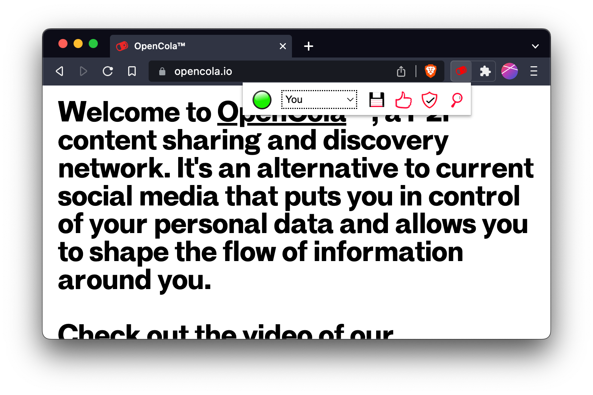

# opencola-alpha

Welcome to the OpenCola alpha. We look forward to hearing your feedback and getting help ironing out the wrinkles. 

While most of the foundation is complete, there are some key missing features that we're working on. The most noticiable one is that you can only save links - we do not yet support adding arbitrary files (e.g. images, pdfs, etc). This is next on our list to complete.

Feel free to add issues your come across to [issues](https://github.com/johnmidgley/opencola-alpha/issues) for this repo. We have also set up a forum on discord to help users as well as let them help each other. 

You're also welcome to share this alpha with friends, but we are limited on the amount of support we can provide, so we will prioritize those on the alpha list.

# Installation

## Prerequisites

Download and install Docker from https://www.docker.com/

<details><summary>Why Docker?</summary>
<br>
<p>
OpenCola currently runs inside a docker container, which provides a few advantages over a direct install:

1. It isolates the application so it can only access it's data folder and communicate on controlled ports (5795 for http and 5796 for https)
2. It isolates system dependencies (i.e. the Java 11 runtime)
3. It allows for a network of isolated services to be deployed (i.e. Tor proxy and router)
4. It makes it easy for OpenCola to be hosted on another computer, if desired.
</p>
</details>

In order to make sure that OpenCola runs at startup / login, set docker to start when you log in:


## Install OpenCola

1. Download the [release](https://github.com/johnmidgley/opencola-alpha/releases/tag/v0.1.0-alpha)
2. Unarchive it wherever you like (we'll call this location $OPENCOLA)

# Starting OpenCola

Open a terminal and navigate to $OPENCOLA. Then follow the instructions for you OS:

<details><summary>MacOS</summary>

```
cd unix
./start
```

You should see output similar to:

```
Creating storage
No SSL certificate found
[+] Running 2/2
 ⠿ Network opencola_default   Created 0.0s
 ⠿ Container opencola-server  Started 0.3ss
Docker container started
Waiting for certificate creation
New certs have been created. Install (y/n)?
```

If this is the first time you're starting OpenCola, a TLS certificate will have been generated so that you can use OpenCola over https[^1]. Enter 'y' to install the certificate. This requires sudo access, so you will have to enter your system password on the command line, and once again in a UI dialog for the key tool.

[^1]: You can always generate new certificates by stopping your server, deleting storage/cert/opencola-ssl* and restarting your server. 

```
y
~/.opencola/storage/cert ~/dev/opencola/install/unix
Password:
~/dev/opencola/install/unix
Server started - visit http://localhost:5795
                   or https://localhost:5796 (Secure - recommended)
```

</details>

<details><summary>Windows</summary>

1. Click the Start icon in the taskbar or hit the windows key. 
2. Type 'command prompt'
3. Click "Run as Administrator"

```
cd $OPENCOLA\windows
start.bat
```

You'll see a number of log lines and then a browser window will open to set a password.

To install certificates so that you can use https:

```
cd %USERPROFILE%\AppData\Roaming\opencola\storage\cert
install-cert.bat
```

</details>
<details><summary>Linux</summary>

```
cd unix
./start
```

You should see output similar to:

```
Creating storage
No SSL certificate found
Creating network "opencola_default" with the default driver
Building oc
Creating opencola-server ... done
Docker container started
Waiting for certificate creation
New certs have been created. Install (y/n)?
```

If this is the first time you're starting OpenCola, a TLS certificate will have been generated so that you can use OpenCola over https[^1]. Enter 'y' to install the certificate. On linux, this must be done manually, so follow the instructions that are output:

```
A certificate has been placed at ~/opencola-ssl.pem
You must manually install it into your browser. For Chome based browsers:
 1. Open chrome://settings/certificates in your browser
      (or brave://settings/certificates for Brave)
 2. Select the 'Authorities' tab
 3. Click the 'Import' button'
 4. Select 'opencola-ssl.pem' from your home directory
 5. Check 'Trust this certificate for identifying websites'
 6. Click 'OK'

~/dev/opencola/install/unix
Server started - visit http://localhost:5795
                   or https://localhost:5796 (Secure - recommended)
```                   

</details> 
 
 Once you've followed the instructions for you OS, navigate to https://localhost:5796. (You can use plain http link too, but it is not secure)
 
## Setting a Password
The first time you start OpenCola, you'll be prompted to set a password:


Enter a password and confim it. 

## Logging in

After setting your password, or whenever you start OpenCola thereafter, you will be prompted to enter a username and your password to continue. The user name is used for web authentication. It can be anything you like, but if you want to change it, you must set it in the config file (storage/opencola-server.yaml). Once your password is set, you'll be prompted to login to the app. Using the default username 'oc' the page looks like:


Lastly, you will need to authenticate your browser:


Now OpenCola is ready to use, and you will see your (empty if this is the first time running) feed:


# Setting up Your User

You can set a display name and image for yourself in peer settings by clicking the  icon:


Fields:

| Field | Description |
| --- | --- |
|  | Name visible to peers when you connect (more later) |
|  | Your gobally unique OpenCola user id - not changeable |
|  | A cryptogrpahic public key used to encrypt and sign data - not changeable yet |
|  | The address at which peers can request data from you. Default is to use the OpencCola relay server (more later) |
|  | Url of image for your picture. This has to be a web link right now. |
|  | Whether or not the user is actively being sychronized with (more later) |

# The Browser Extenion

## Installing the Extension

OpenCola comes with a browser extension. It currenlty only works with Chrome based browsers (e.g. Chrome, Chromium, Brave, Edge). We will provide other extnsions in the future. To install the extension, go to your browsers extensions page. In Brave, navigate to brave://extensions, which looks like:


In the future, we will provide the extension in the Web Store, but for now you must install it manually. To do so, click the "Developer mode" slider: 


Then click "Load Unpacked" and select the folder $OPENCOLA/chrome. 


Lastly, pin the extension to your toolbar (so it's always visible) by clicking the extension icon (the puzzle piece) and click the pin beside OpenCola:


## Using the Extension

To use the extension, simply click the OpenCola icon in the toolbar:



The various icons mean:

| Icon | Description |
| --- | --- |
|  | Staus of the extension. Green means all good, yellow means working, and red means error. Check the Javascript console for more info on error. |
|  | Save the current page (Add to feed, store archive, and index for search) |
|  | Like the current page (saves page implicitly |
|  | Trust the current page (saves page implicitly) | 
|  | Go to search / feed page | 

# Understanding Your Feed

You can add items to your feed by using the toolbar or creating organic (not tied to a url) posts using the  button at the top right of the feed page. Once you've added to your feed, it will look something like (annotations in red):


You can see activty for the post as well as take action by using the action bar at the bottom. If you click the action icon, the corresponding action will be taken. Underlined (with a grey bar) action icons indicate actions that you have taken yourself. The number beside the icon indicates how many actions of that type have occured. You can see the individual actions by clicking expand () icon. 

| Action | Description |
| --- | --- |
|  | Save the post. This essentially copies the post and allows any of your peers to see it as if it came from you. |
|  | Like the post (save post implicitly) |
|  | Add tags to the post |
|  | Comment on the post (save post implicitly) |
|  | Edit the post. Gives you an option to delete the post (if it was yours) |

You can search your feed by entering a query in the search box. Currently, search is exact match only, but will be improved in the future.

# Adding Peers

To add a peer, click the  icon at the top right of your feed and then click the  icon. 


Copy the token beside "Give this token to your peer:" and give it to a peer (via Signal, email, sms, etc). Enter the token you receive from the peer in the other box. Click "Add" - edit the name a image url if desired, and then click "Save".

By default you will be using the OpenCola Relay server (ocr://relay.opencola.net) to communicate with peers. Communication is end to end encrypted, but does travel through a central server. There are more advanced options (Tor, ZeroTier VPN) that will be documented, but are not for the faint of heart, so we default to the relay server as a "batteries included" solution. 

# Removing Peers

You can "disconnect" from a peer without losing any of the posts your have accumulated by simply unchecking the box beside the  icon for the peer. If you want to completely disconnect, edit the peer and click "Delete".


