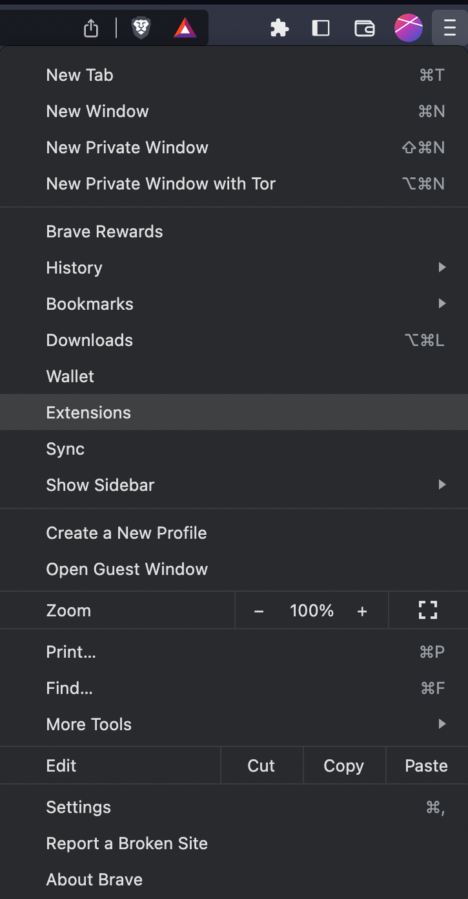
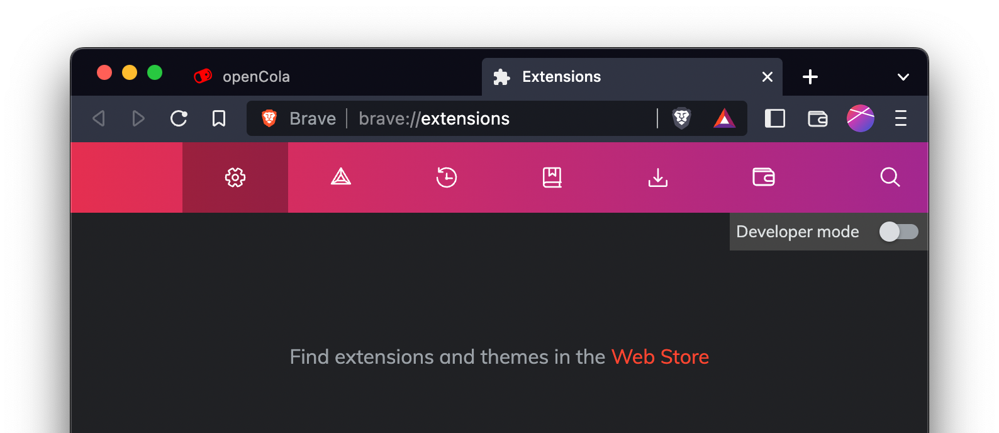
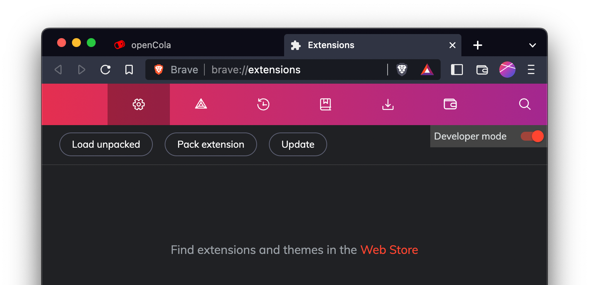
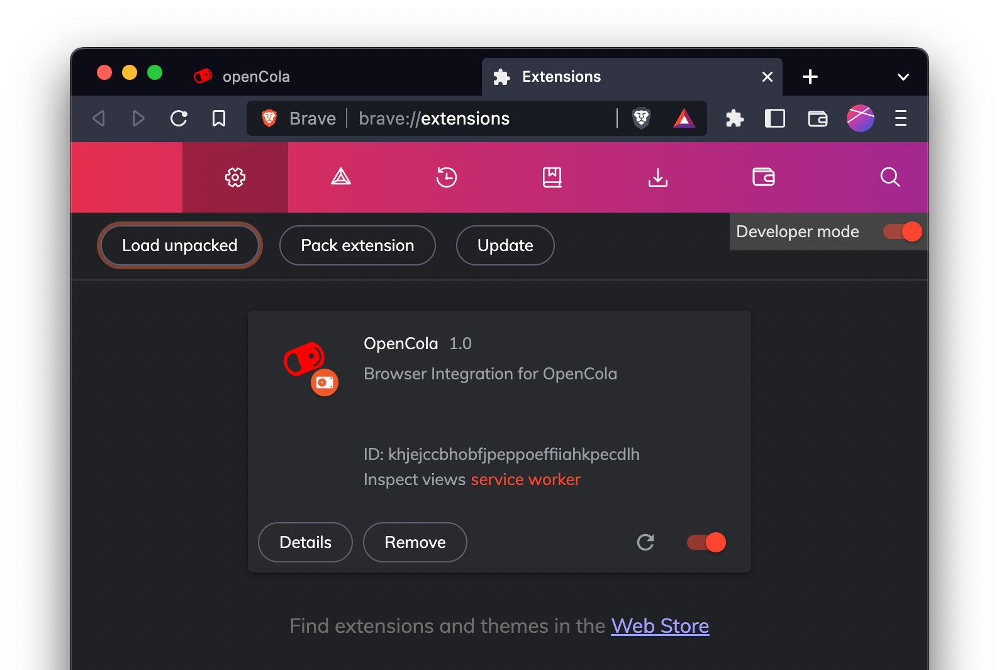

# Installing the  Browser Extension

OpenCola has a browser extension that makes it easier to interact with web pages. It currenlty only works with Chrome based browsers (e.g. Chrome, Chromium, Brave, Edge). We will provide other extnsions in the future. As well, the extension is a manual install and we will provide the extension in the Web Store in a future release.

To start,  <a href="https://github.com/johnmidgley/opencola-alpha/releases/download/1.3.1/OpenCola-Chrome-1.3.1.zip">download the extension</a> and place it in your home direcory (or anywhere you prefer). Then go to your browsers extensions page, by clicking the menu icon on the far right of the url bar (the icon with 3 horizontal lines or 3 dots), and selecting extensions:

In Brave, this looks like (other browser will be very similar):

Click the "Developer mode" slider near the top right:

Click "Load Unpacked" and select the folder $OPENCOLA/chrome.

Lastly, pin the extension to your toolbar (so it's always visible) by clicking the extension icon (the puzzle piece) and click the pin beside OpenCola:

If you would like to use the extension on a different computer than where the server is running, install the extension and then set the service url in the extension's options  to point to the server:

1. Right click the extension
1. Select "Options"
1. Edit the "Service Host" field
1. Hit "Return" or click the "Save Button"

