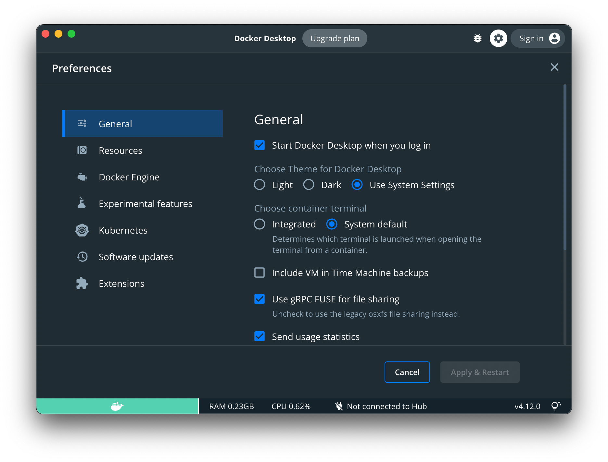
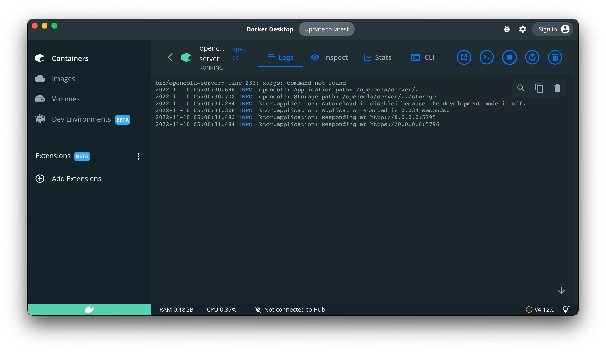

# Install OpenCola for use in Docker

## Install Docker

Download and install Docker from https://www.docker.com/

<details><summary>Docker Benefits</summary>
<br>
<p>
Running OpenCola in Docker provides a few advantages over a direct install:

1. It isolates the application so it can only access it's data folder and communicate on controlled ports (5795 for http and 5796 for https)
2. It isolates system dependencies
3. It allows for a network of isolated services to be deployed (i.e. Tor proxy and router)
4. It makes it easy for OpenCola to be hosted on another computer, if desired.
</p>
</details>
 
In order to make sure that OpenCola runs at startup / login, set docker to start when you log in:



</details>

## Install OpenCola

1. Download the [release](https://github.com/johnmidgley/opencola-alpha/releases/download/v1.3.4/OpenCola-Docker-1.3.4.zip)
2. Unarchive it wherever you like (we'll call this location $OPENCOLA)

## Starting OpenCola

Open a terminal and navigate to $OPENCOLA. Then follow the instructions for you OS:

<details><summary>MacOS</summary>

```
cd mac
./start
```

You should see output similar to:

```
Creating storage
No SSL certificate found
[+] Running 2/2
 ⠿ Network opencola_default   Created 0.0s
 ⠿ Container opencola-server  Started 0.3ss
Docker container started
Waiting for certificate creation
```

If this is the first time you're starting OpenCola, a TLS certificate will have been generated so that you can use OpenCola over https. A dialog will open asking for your password so that the certificate can be added to your keychain. Enter your password.


```
y
Password:
Server started

Insecure URLS:
http://localhost:5795 (Local only)
http://192.168.195.16:5795

Secure URLs (Recommended):
https://localhost:5796 (Local only)
https://192.168.195.16:5796
```

</details>

<details><summary>Windows</summary>

1. Click the Start icon in the taskbar or hit the windows key.
2. Type 'powershell'
3. Click "Run as Administrator" on the right panel

 In the terminal type:
 
```
cd $OPENCOLA\windows
./start
``` 

 > **NOTE:** If this fails, it's likely because script execution is disabled. To enable script execution:
 > ```
 > Set-ExecutionPolicy -Scope CurrentUser -ExecutionPolicy Bypass -Force
 > ```
 > If you'd like to disable script execution when you're done:
 > ```
 > Set-ExecutionPolicy -Scope CurrentUser -ExecutionPolicy Restricted -Force
 > ```

You should see output similar to (if you're not using Docker, things will look a bit different, and you will likely be prompted to install java):

```
Looks like Docker is installed in the default location
OpenCola storage does not exist. Making a new one...
No SSL certificate found
Starting OpenCola with docker..
[+] Building 0.6s (8/8) FINISHED
 => [internal] load build definition from Dockerfile                                                               0.0s
 => => transferring dockerfile: 32B                                                                                0.0s
 => [internal] load .dockerignore                                                                                  0.0s
 => => transferring context: 2B                                                                                    0.0s
 => [internal] load metadata for docker.io/library/openjdk:17                                                      0.5s
 => [1/3] FROM docker.io/library/openjdk:17@sha256:528707081fdb9562eb819128a9f85ae7fe000e2fbaeaf9f87662e7b3f38cb7  0.0s
 => [internal] load build context                                                                                  0.0s
 => => transferring context: 19.62kB                                                                               0.0s
 => CACHED [2/3] COPY ./opencola/ /opencola                                                                        0.0s
 => CACHED [3/3] WORKDIR /opencola/server                                                                          0.0s
 => exporting to image                                                                                             0.0s
 => => exporting layers                                                                                            0.0s
 => => writing image sha256:44acfec9f4345aacc8f2ce58f9e69fbaa7c04611985f65549f86d989a1fab2b8                       0.0s
 => => naming to docker.io/library/opencola-oc                                                                     0.0s

Use 'docker scan' to run Snyk tests against images to find vulnerabilities and learn how to fix them
[+] Running 2/2
 - Network opencola_default  Created                                                                               0.7s
 - Container opencola-oc-1   Started                                                                               1.3s
Waiting for certificate creation

ROOT "Trusted Root Certification Authorities"
Signature matches Public Key
Certificate "opencola" added to store.
CertUtil: -addstore command completed successfully.
Server Started

Insecure URLs:
http://localhost:5795
http://172.20.112.1:5795
http://192.168.50.204:5795
http://127.0.0.1:5795

Secure URLs:
https://localhost:5796
https://172.20.112.1:5796
https://192.168.50.204:5796
https://127.0.0.1:5796

Waiting to launch browser...
```

In a few seconds, a browser will launch the OpenCola start page.

</details>
<details><summary>Linux</summary>

```
cd linux
./start
```

You should see output similar to:

```
Creating storage
No SSL certificate found
Creating network "opencola_default" with the default driver
Building oc
Creating opencola-server ... done
Docker container started
Waiting for certificate creation

Server started

Insecure URLS:
http://localhost:5795 (Local only)
http://192.168.50.127:5795
http://172.19.0.1:5795

Secure URLs (Recommended):
https://localhost:5796 (Local only)
https://192.168.50.127:5796
https://172.19.0.1:5796
```                   
</details>
<p>

Once you've followed the instructions for you OS, navigate to https://localhost:5796.

>You can see what OpenCola logs by opening the Docker dashboard, expanding the opencola container and then opening the server:
> 
> The logs will look something like:
> 
> Errors will be highlighted in red.

Back to: [Setting Up](../../README.md#setting-up)
