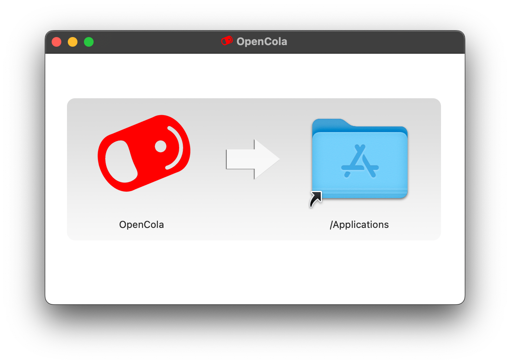
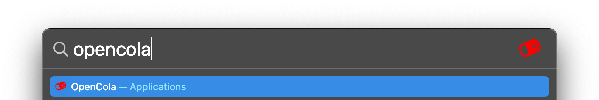
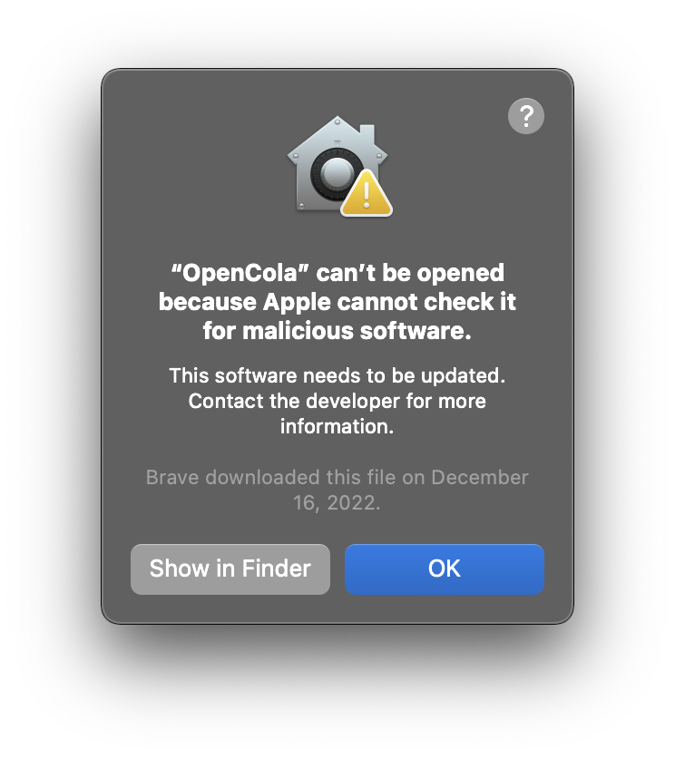
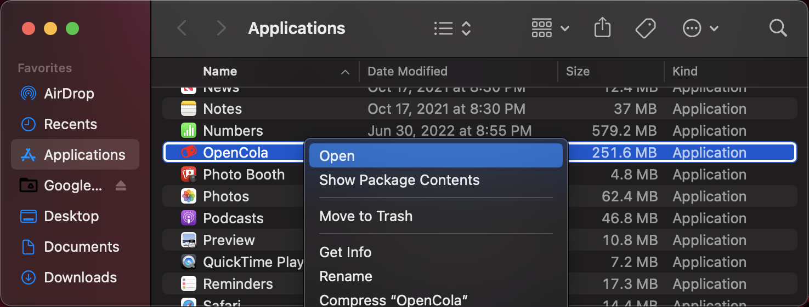
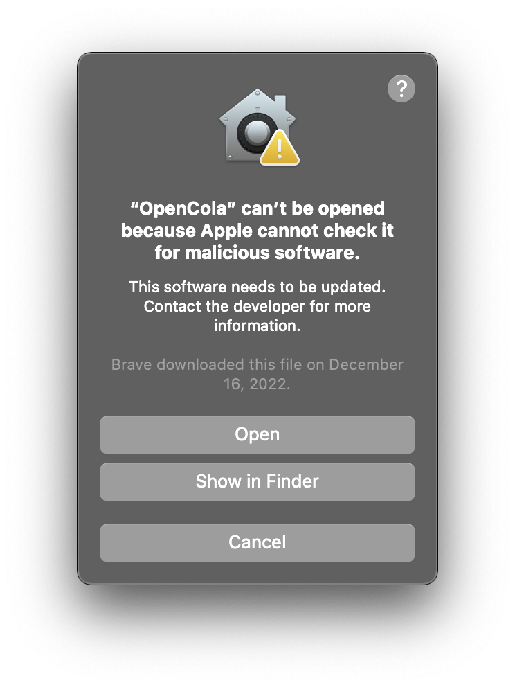

# Installing OpenCola on MacOS

1. <strong>Download</strong> the [Mac Release](https://github.com/johnmidgley/opencola-alpha/releases/download/1.3.1/OpenCola-MacOS-v1.3.1.dmg) (Universal)
2. <Strong>Open</strong> the disk image:

3. Click and drag the <strong>OpenCola</strong> icon and drop in <strong>Applications</strong>
4. Close the disk image <strong>(Command + E)</strong>

<!--
> If need, remove the app from qurantine: <br/>
> ``` xattr -d com.apple.quarantine /Applications/OpenCola.app/  ```
-->
5. Open OpenCola: <strong>(Command + space)</strong>, type <strong>opencola</strong> and hit <strong>Return</strong>

6. Since the DMG is signed, but not notarized (we'll do this next release), you won't be able to directly open it the first time. Click <strong>Show in Finder</strong>

7. Hold <strong>Control</strong> and <strong>Click on OpenCola</strong> (or <strong>Right-Click on OpenCola</strong>) and select <strong>Open</strong>:


8. On the resulting dialog, click <strong>Open<strong>:


6. In a few seconds, a browser window will open. Follow the instructions on the page for installing an SSL certificate. (Certificates will be placed in ```~/Library/Application\ Support/OpenCola/storage/cert```)

> NOTE: If you'd like to view the logs, open a terminal and run:
> ```
> tail -f ~/logs/opencola/opencola-server.log
> ```

Back to: [Setting up](../../README.md#setting-up)

