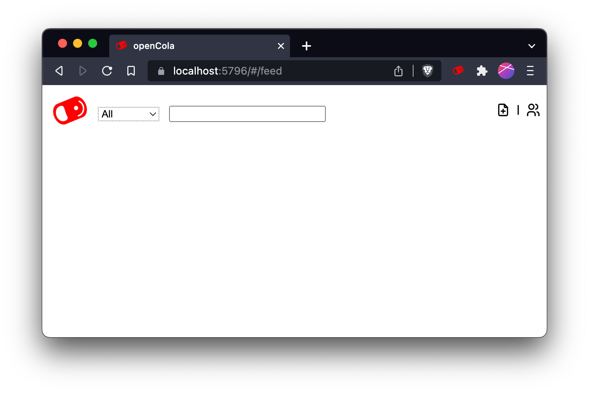

# Setting Up

After starting OpenCola and installing certificates, you will see:

Enter any username you want (it is only seen by you and used to log in), a password and confirm it. 

<p> <strong>*** Save this password somewhere safe. If you lose it, you can reocover your data, but your identity will be
lost and you will have to reconnect with any peers ***</strong> </p>

>Leave <strong>Auto-Start</strong> checked to have OpenCola start when you log in, so that you can exchange posts with peers in the background. 
>
> On MacOS, setting autostart will trigger a security dialog, asking for permission to control <strong>System Events<strong>. Click <strong>OK</strong> to allow OpenCola to auto-start.
>
> 
>
> On Linux, autostart assumes a gnome based environment, and will add a file to ```~/.config/autostart```

Click <strong>Start</strong>, after which you will see:


The server will take a few seconds to create and initialize your storage, after which you will end up on your feed:


You can set a display name and image for yourself in peer settings by clicking the . This view shows you, along with any peers your have (connecting to others will be described later). To edit fields, click <strong>Edit</strong> 


The fields for each entry are

| Field | Description |
| --- | --- |
|  | Name visible to peers when you connect (more later) |
|  | Your gobally unique OpenCola user id - not changeable |
|  | A cryptogrpahic public key used to encrypt and sign data - not changeable yet |
|  | The address at which peers can request data from you. Default is to use the OpencCola relay server (see [Managing Peers](#managing-peers) for more details) |
|  | Url of image for your picture. This has to be a web link right now. |
|  | Whether or not the user is actively being sychronized (more later) |

Next: [The Browser Extension](../README.md#browser-extension)