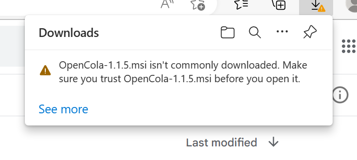
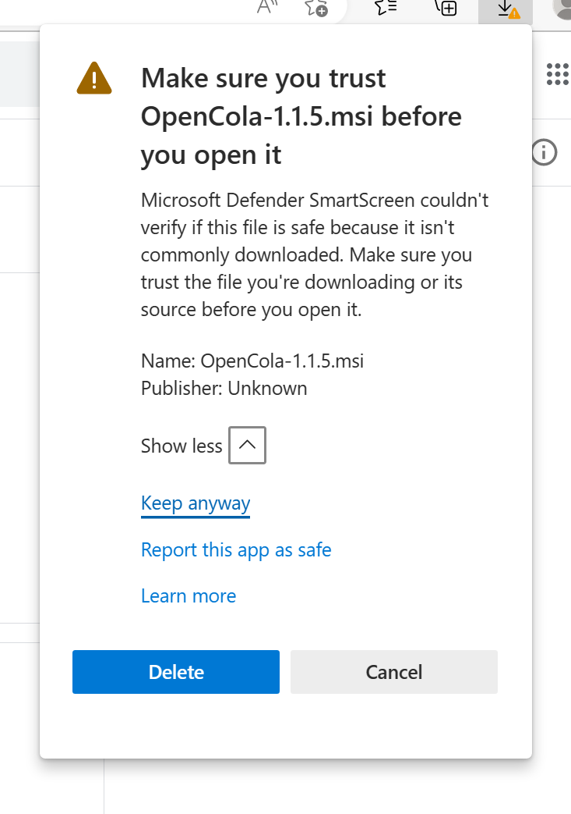
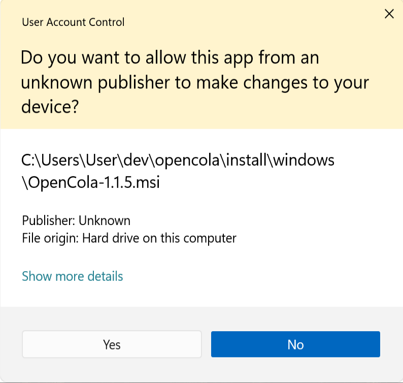
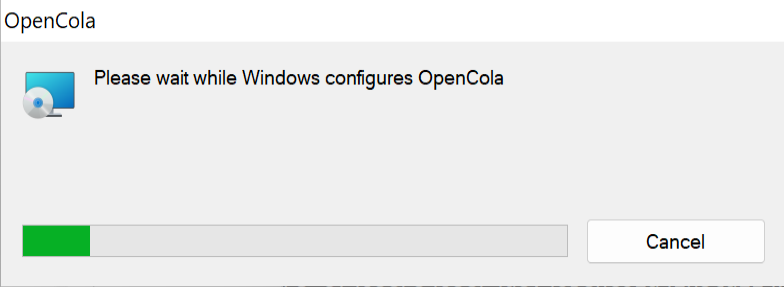

# Installing OpenCola on Windows


1. <strong>Download</strong> the [Windows Installer](https://github.com/johnmidgley/opencola-alpha/releases/download/v1.3.4/OpenCola-Windows-1.3.4.msi) 

Once downloaded, you may get the following warning:



If so, click <strong>See more</strong>, expand <strong>Show more</strong> and click <strong>Keep anyway</strong>:



2. Open the installer
3. Click <strong>Yes</strong> at the security prompt:
<p>
        
</p>
4. The application will install:
<p>
        
</p>
5. Click on the OpenCola Desktop icon to start. 
<p>
        
</p>
6. A browser window will open. Follow the instructions on the page for installing an SSL certificate.  (Certificates will be placed in ```$home\AppData\Local\OpenCola\storage\cert```)

> NOTE: If you'd like to view the logs, open a PowerShell window and run:
> ```
> Get-Content $home/logs/opencola/opencola-server.log -Tail 20 -Wait
> ```

Back to: [Setting Up](../../README.md#setting-up)
